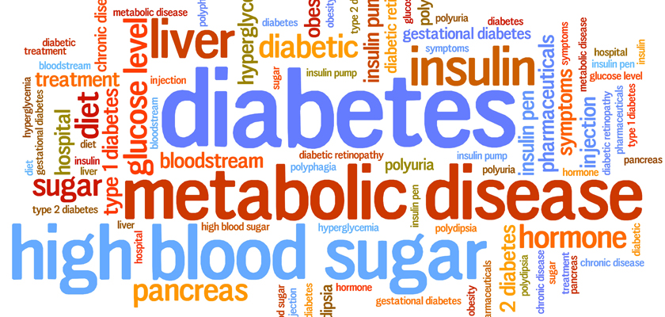

## Diabetes classification machine learning model
 
  
 

• Kaggle diabetes dataset has been used for the predictive analyses.

• An accuracy of 99% has been achieved using the test data set.

• I have also deployed the model using Heroku cloud please find the link below.
  https://diabetes-predict-ml.herokuapp.com/
